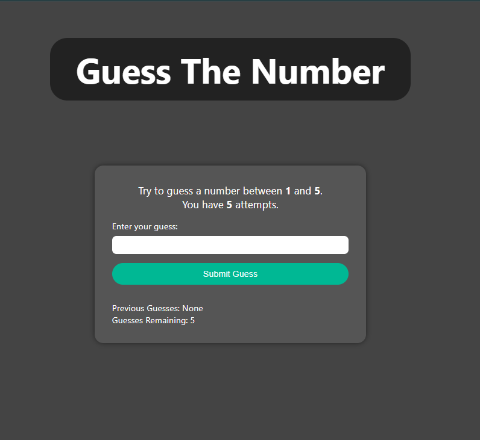

# 🎯 Guess The Number  
A simple and fun JavaScript mini-game where you try to guess a secret number between **1 and 5**.  
You get **5 attempts** — and the game tracks your previous guesses and remaining chances.

---

## 📸 Preview  


<p align="center">
  
</p>

---

## 🚀 Live Demo

<p align="center">
  <a href="https://dipanshudeep.github.io/guss_the_number/"
     style="text-decoration:none;
            padding: 10px 22px;
            border: 2px solid white;
            color: white;
            font-weight: bold;
            border-radius: 8px;">
    Live Demo
  </a>
</p>


---

## 🧩 Features

- 🔢 Random number between **1 and 5**
- 🖐️ **5 total attempts**
- 📜 Shows your *previous guesses*
- ⏳ Updates remaining attempts live
- 🟢 Alerts you when you win
- 🔴 Displays the correct answer if you lose
- 🔁 Auto-reset after each game
- 🧼 Clean UI with smooth interaction


---

## 🛠 Technologies Used

- **HTML5**
- **CSS3**
- **JavaScript (Vanilla)**

---

## 📜 Game Logic Explained

### 🎯 Random Number Generation
```js
let randNum = Math.floor(Math.random() * 5) + 1;
```
## ➕ Tracking Guesses
```js
guesses.push(guess);
preGuess.textContent = guesses.join(', ');
remainGuess.textContent = guessesLeft;
```
## 🏆 Winning Condition
```js
if (guess === randNum) {
  alert('Congratulations! You guessed the number!');
  resetGame();
}

```
## ❌ Losing Condition
```js
else if (guessesLeft === 0) {
  alert(`You've used all attempts. The number was ${randNum}.`);
  resetGame();
}

```
## 🔄 Resetting the Game
```js
function resetGame() {
  guesses = [];
  guessesLeft = 5;
  preGuess.textContent = 'None';
  randNum = Math.floor(Math.random() * 5) + 1;
  button.textContent = 'Start Game';
  gameStarted = false;
}
```
- 🧠 What You Learn from This Project

  - DOM manipulation

  - Event listeners

  - Condition checking

  - Game state handling

  - Arrays & number validation

  - Random number logic

  - Updating UI dynamically

